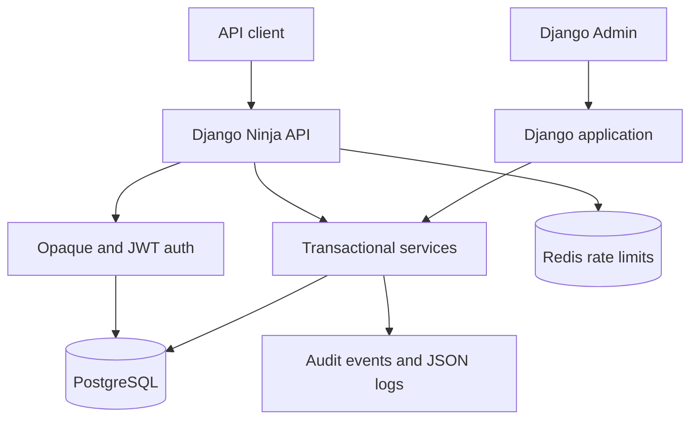

# ChainScribe API

[](https://github.com/DizzyZ7/ChainScribe-API/actions/workflows/ci.yml)

ChainScribe is a security-focused backend for publishing articles and comments on a
cryptocurrency website. It implements a versioned Django Ninja API, PostgreSQL persistence,
opaque API tokens, JWT access/refresh tokens, ownership enforcement, immutable audit events,
structured logs, rate limiting, Django Admin, containers and continuous verification.

This repository contains only the publishing backend. It deliberately contains no wallet,
blockchain, custody, exchange or payment logic.

## What is implemented

- registration and login with normalized ASCII usernames and Django password validation;
- Argon2 password hashing;
- primary opaque-token authentication using exactly 256 URL-safe random characters;
- SHA-256-only opaque-token storage, expiry, revocation and throttled last-use tracking;
- additional JWT pair, refresh, verify and blacklist endpoints using `django-ninja-jwt`;
- article and comment CRUD with server-side ownership checks;
- public published articles, private drafts and category filtering;
- UUID public identifiers and database integrity constraints;
- consistent JSON errors and correlation IDs;
- fixed-window application rate limiting backed by Redis in container environments;
- structured JSON logs with credential redaction;
- immutable database audit events for security-relevant mutations and denials;
- hardened Django Admin configuration;
- liveness/readiness checks;
- PostgreSQL and Redis Docker Compose stack;
- unittest-based API/integration tests on PostgreSQL;
- CI on Python 3.10 and 3.12, dependency audit, Docker build and real smoke journey.

## Quick start

Requirements: Docker Engine with Docker Compose v2.

```bash
docker compose up --build
```

Wait until the `web` service is healthy, then open:

- API documentation: <http://127.0.0.1:8000/api/v1/docs>
- Django Admin: <http://127.0.0.1:8000/admin/>
- readiness: <http://127.0.0.1:8000/api/v1/health/ready>

Create an administrator:

```bash
docker compose exec web python manage.py createsuperuser
```

Run the end-to-end journey against the active stack:

```bash
python scripts/smoke_test.py
```

Stop the stack without deleting persisted database data:

```bash
docker compose down
```

Use `docker compose down --volumes` only when intentionally deleting local PostgreSQL and
Redis data.

## Local Python setup

Python 3.10+ is supported. PostgreSQL is the authoritative database; SQLite is available only
through the explicit `USE_SQLITE_FOR_TESTS=1` test escape hatch and is not a supported runtime.

```bash
python -m venv .venv
source .venv/bin/activate
python -m pip install --requirement requirements/dev.txt
cp .env.example .env
python manage.py migrate
python manage.py createsuperuser
python manage.py runserver
```

Environment variables from `.env` are not loaded automatically by Django. Export them in the
shell, use a process manager, or rely on Docker Compose.

## API contract

All application endpoints are under `/api/v1` and use JSON.

| Method | Endpoint | Authentication | Purpose |
|---|---|---|---|
| POST | `/auth/register` | Public | Create user and opaque token |
| POST | `/auth/login` | Public | Verify credentials and issue a new opaque token |
| POST | `/auth/logout` | Opaque token | Revoke the current opaque token |
| GET | `/auth/me` | Opaque token or JWT | Return the current safe user profile |
| POST | `/auth/jwt/pair` | Public | Issue JWT access/refresh pair |
| POST | `/auth/jwt/refresh` | Public | Rotate refresh token and issue access token |
| POST | `/auth/jwt/verify` | Public | Verify a signed JWT |
| POST | `/auth/jwt/blacklist` | Public | Revoke a refresh token |
| GET | `/categories` | Public | List active categories |
| GET | `/articles` | Optional | List published articles and the caller's drafts |
| POST | `/articles` | Opaque token or JWT | Create an article |
| GET | `/articles/{id}` | Optional | Read an accessible article |
| PATCH | `/articles/{id}` | Opaque token or JWT | Update an owned article |
| DELETE | `/articles/{id}` | Opaque token or JWT | Delete an owned article |
| GET | `/articles/{id}/comments` | Optional | List comments on an accessible article |
| POST | `/articles/{id}/comments` | Opaque token or JWT | Create a comment |
| GET | `/comments/{id}` | Optional | Read an accessible comment |
| PATCH | `/comments/{id}` | Opaque token or JWT | Update an owned comment |
| DELETE | `/comments/{id}` | Opaque token or JWT | Delete an owned comment |
| GET | `/health/live` | Public | Process liveness without a database query |
| GET | `/health/ready` | Public | PostgreSQL readiness query |

`Optional` means anonymous callers can read published content. A valid token additionally makes
the caller's drafts visible. A malformed or invalid supplied token receives `401`; it never
silently degrades to anonymous access.

### Opaque token authentication

Opaque tokens are generated with `secrets.token_urlsafe(192)`, producing exactly 256 URL-safe
characters. Only their SHA-256 digest is stored. The raw token appears once in the registration
or login response and must be stored by the client as a secret.

```http
Authorization: Token <256-character-token>
```

Tokens in query strings or request bodies are not accepted. Successful authentication responses
include `Cache-Control: no-store`.

### JWT authentication

JWT access tokens use a distinct prefix:

```http
Authorization: Bearer <jwt-access-token>
```

Access tokens live for five minutes by default. Refresh tokens live for 24 hours, rotate on use,
and the previous token is blacklisted. The JWT signing key is independent from the Django secret.

### Registration example

```bash
curl --request POST http://127.0.0.1:8000/api/v1/auth/register \
  --header 'Content-Type: application/json' \
  --data '{"username":"dizzy","password":"Correct-Horse-Battery-2026!"}'
```

Store the returned `token` without writing it to logs or source code:

```bash
export CHAIN_SCRIBE_TOKEN='<returned-token>'
```

### Article and comment example

```bash
curl --request POST http://127.0.0.1:8000/api/v1/articles \
  --header "Authorization: Token ${CHAIN_SCRIBE_TOKEN}" \
  --header 'Content-Type: application/json' \
  --data '{"title":"Release notes","content":"Verified build.","status":"published"}'
```

```bash
curl --request POST http://127.0.0.1:8000/api/v1/articles/ARTICLE_UUID/comments \
  --header "Authorization: Token ${CHAIN_SCRIBE_TOKEN}" \
  --header 'Content-Type: application/json' \
  --data '{"body":"Reviewed."}'
```

### Pagination and filtering

Article and comment collections use `limit` and `offset`. `limit` must be between 1 and 100.
Article filters are `category` (slug), `status` and `author` (UUID). Access filtering is applied
before user-supplied filters, so filters cannot disclose private drafts.

### Error envelope

Errors never return HTML from the API:

```json
{
  "detail": "You do not own this article.",
  "code": "permission_denied",
  "request_id": "1d7b809d-ef3f-4d8a-af41-147d8cc04c0c"
}
```

Validation errors may additionally include a sanitized `fields` member. Pydantic input values
are intentionally excluded so passwords and tokens cannot be reflected.

| Status | Meaning |
|---|---|
| 200 | Read/update succeeded |
| 201 | Resource created |
| 204 | Delete/logout succeeded |
| 400 | Invalid request |
| 401 | Missing, invalid, expired or revoked credentials |
| 403 | Authenticated caller is not the owner |
| 404 | Resource is absent or intentionally concealed |
| 409 | Username conflict |
| 422 | Schema or domain validation failed |
| 429 | Rate limit exceeded |
| 500 | Internal failure with no implementation detail disclosed |

## Architecture



Application boundaries:

- `accounts`: custom user, opaque token lifecycle, dual authentication and JWT endpoints;
- `blog`: categories, article/comment models, selectors, services and API routes;
- `audit`: immutable events and admin audit hooks;
- `core`: logging, correlation IDs, rate limiting, errors, checks and health endpoints;
- `config`: split settings, root API and Django entrypoints.

Mutation services use database transactions and row locks for updates, deletions and token
revocation. Ownership is derived only from the authenticated server-side principal. Client
`author_id` and `user_id` fields are forbidden by input schemas.

See [architecture decisions](docs/architecture.md) for the trust boundaries and data lifecycle.

## Logging and audit

Application logs are JSON on stdout. They include timestamp, level, event, request ID, method,
path without query string, status, latency, safe user/object identifiers and outcome.

The formatter redacts JWT-shaped values, 256-character opaque tokens and authorization/cookie
headers. Request bodies, response bodies, article text, comment text, passwords and credentials
are never logged.

Database `AuditEvent` records cover authentication, content mutations, authorization denials and
Django Admin mutations. Audit rows cannot be changed or removed through models or Admin.

## Security model

Primary threats and controls:

| Threat | Control |
|---|---|
| Credential stuffing | Argon2, generic login error, auth rate limit, edge limit recommended |
| Token theft | TLS requirement, header-only transport, digest-only storage, expiry/revocation, no-store |
| IDOR | UUID IDs plus mandatory server-side owner checks and denial tests |
| Mass assignment | Forbid unknown fields and derive authors from authentication |
| SQL injection | Validated typed parameters and Django ORM |
| XSS | Content remains untrusted text; backend never marks it safe |
| CSRF | Django Admin retains CSRF; API credentials are explicit headers, not cookies |
| Secret leakage | Environment configuration, structured redaction and negative logging tests |
| Brute-force writes | Redis-backed application limits; WAF/edge limits still required |
| Dependency flaws | Exact direct pins and `pip-audit` in CI |
| Lost updates/races | Row locks on ownership-sensitive updates and deletes |

The production deployment still requires an external penetration test, WAF or gateway request
limits, managed secret storage, database encryption and organization-specific monitoring.

## Configuration

| Variable | Required in production | Purpose |
|---|---:|---|
| `DJANGO_SETTINGS_MODULE` | Yes | Use `config.settings.production` |
| `DJANGO_SECRET_KEY` | Yes | Django signing secret, at least 50 characters |
| `JWT_SIGNING_KEY` | Yes | Independent JWT HMAC key, at least 32 characters |
| `DJANGO_ALLOWED_HOSTS` | Yes | Comma-separated host allowlist |
| `CORS_ALLOWED_ORIGINS` | Yes | Exact browser origin allowlist |
| `CSRF_TRUSTED_ORIGINS` | Yes | Exact HTTPS Admin origins |
| `POSTGRES_DB` | Yes | PostgreSQL database |
| `POSTGRES_USER` | Yes | PostgreSQL role |
| `POSTGRES_PASSWORD` | Yes | PostgreSQL password |
| `POSTGRES_HOST` | Yes | PostgreSQL host |
| `POSTGRES_PORT` | No | Defaults to 5432 |
| `REDIS_URL` | Yes | Shared cache and rate-limit state |
| `API_TOKEN_TTL_DAYS` | No | Opaque-token lifetime, default 30 days |
| `JWT_ACCESS_MINUTES` | No | JWT access lifetime, default 5 minutes |
| `JWT_REFRESH_HOURS` | No | JWT refresh lifetime, default 24 hours |
| `TRUST_PROXY_HEADERS` | Yes behind proxy | Trust `X-Forwarded-Proto` and client IP chain |
| `SECURE_SSL_REDIRECT` | No | Enabled by default in production |
| `API_DOCS_ENABLED` | No | Disabled by default in production |
| `LOG_LEVEL` | No | Defaults to INFO |
| `GUNICORN_BIND` | No | Listener address, default `0.0.0.0:8000` |
| `WEB_CONCURRENCY` | No | Gunicorn worker count, production override defaults to 4 |
| `GUNICORN_THREADS` | No | Threads per worker, default 2 |

Generate independent secrets with a cryptographic generator, for example:

```bash
python -c 'import secrets; print(secrets.token_urlsafe(64))'
```

Do not reuse the displayed value across Django, JWT, environments or services.

## Testing and quality gates

The suite uses Django `TestCase`/`TransactionTestCase` semantics and the Django test client. API
integration tests use PostgreSQL in CI; ORM behavior is not mocked. Infrastructure failure tests
mock only the unavailable boundary they are designed to exercise.

```bash
ruff check .
ruff format --check .
python manage.py makemigrations --check --dry-run
python manage.py check
coverage run manage.py test --verbosity=2
coverage report --fail-under=90
pip-audit --requirement requirements/base.txt
```

CI also runs the full suite on Python 3.10 and 3.12, builds the Docker image, starts PostgreSQL,
Redis and Gunicorn, waits for readiness and exercises registration through revoked-token logout.

## Production release

Read the full [deployment runbook](docs/deployment.md). The short form is:

1. provision managed PostgreSQL/Redis and encrypted backups;
2. configure independent secrets in a secret manager;
3. place the container behind an HTTPS reverse proxy/WAF;
4. run migrations as one release job;
5. deploy application replicas with `RUN_MIGRATIONS=false`;
6. verify readiness and the smoke journey;
7. schedule `python manage.py flushexpiredtokens` daily;
8. monitor 401/403/429/500 rates and database/Redis health.

Example release migration with the supplied production override:

```bash
docker compose -f compose.yaml -f compose.prod.yaml run --rm \
  -e RUN_MIGRATIONS=false web python manage.py migrate --noinput
```

Then start the application:

```bash
docker compose -f compose.yaml -f compose.prod.yaml up --detach --build
```

## Backup and restore

Example logical backup:

```bash
docker compose exec -T db pg_dump \
  --username chainscribe --format=custom --no-owner chainscribe > chainscribe.dump
```

Restore into an empty, access-controlled database after testing the backup:

```bash
docker compose exec -T db pg_restore \
  --username chainscribe --dbname chainscribe --clean --if-exists < chainscribe.dump
```

Production backups must be encrypted, stored outside the application host, retention-controlled
and restored in scheduled drills. Redis contains disposable throttling state and is not the
system of record.

## Known limitations

- application rate limiting is fixed-window; an edge token bucket is required for internet scale;
- JWT uses HS256; organizations needing independent verification services should migrate to
  managed asymmetric signing and rotation;
- audit events share PostgreSQL with operational data; regulated deployments should stream them
  to append-only external storage;
- no moderation workflow, full-text search, media upload or soft deletion is included;
- category mutation is intentionally Admin-only;
- deployment credentials and a real VPS are not included in the repository.

## License

MIT. See [LICENSE](LICENSE).
