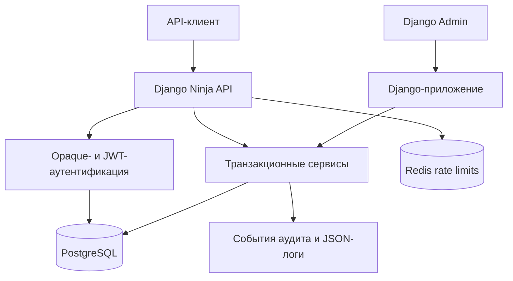

# ChainScribe API

[English version](README.md)

[](https://github.com/DizzyZ7/ChainScribe-API/actions/workflows/ci.yml)

ChainScribe — ориентированный на безопасность backend для публикации статей и комментариев на криптовалютном сайте. Проект реализует версионированный API на Django Ninja, хранение данных в PostgreSQL, непрозрачные API-токены, JWT access/refresh-токены, обязательную проверку владельца ресурсов, неизменяемый аудит, структурированные логи, rate limiting, Django Admin, контейнеризацию и непрерывную автоматическую проверку.

Репозиторий содержит только издательский backend. В нем намеренно отсутствуют кошельки, блокчейн-операции, хранение активов, биржевая логика и платежи.

## Что реализовано

- регистрация и вход с нормализованными ASCII-именами пользователей и стандартной проверкой паролей Django;
- хеширование паролей Argon2;
- основной механизм аутентификации по случайному URL-safe opaque-токену длиной ровно 256 символов;
- хранение только SHA-256-хеша opaque-токена, срок действия, отзыв и ограниченное обновление времени последнего использования;
- дополнительные endpoint выдачи пары JWT, обновления, проверки и blacklist через `django-ninja-jwt`;
- CRUD статей и комментариев с серверной проверкой владельца;
- публичные опубликованные статьи, приватные черновики и фильтрация по категориям;
- публичные UUID-идентификаторы и ограничения целостности базы данных;
- единый формат JSON-ошибок и correlation ID;
- фиксированное окно rate limiting с общим состоянием в Redis для контейнерных сред;
- структурированные JSON-логи с удалением учетных данных;
- неизменяемые события аудита для важных изменений и отказов доступа;
- усиленная конфигурация Django Admin;
- проверки liveness и readiness;
- Docker Compose-стек с PostgreSQL и Redis;
- API- и интеграционные тесты на базе `unittest` с PostgreSQL;
- CI на Python 3.10 и 3.12, аудит зависимостей, сборка Docker и реальный smoke-сценарий.

## Быстрый запуск

Требуется Docker Engine с Docker Compose v2.

```bash
docker compose up --build
```

Дождитесь перехода сервиса `web` в healthy-состояние, затем откройте:

- документацию API: <http://127.0.0.1:8000/api/v1/docs>
- Django Admin: <http://127.0.0.1:8000/admin/>
- readiness: <http://127.0.0.1:8000/api/v1/health/ready>

Создание администратора:

```bash
docker compose exec web python manage.py createsuperuser
```

Запуск сквозного пользовательского сценария против работающего стека:

```bash
python scripts/smoke_test.py
```

Остановка без удаления сохраненных данных PostgreSQL:

```bash
docker compose down
```

Используйте `docker compose down --volumes` только при намеренном удалении локальных данных PostgreSQL и Redis.

## Локальная установка Python

Поддерживается Python 3.10+. PostgreSQL является основной и авторитетной СУБД. SQLite доступен только через явный тестовый переключатель `USE_SQLITE_FOR_TESTS=1` и не является поддерживаемой runtime-средой.

```bash
python -m venv .venv
source .venv/bin/activate
python -m pip install --requirement requirements/dev.txt
cp .env.example .env
python manage.py migrate
python manage.py createsuperuser
python manage.py runserver
```

Django не загружает переменные из `.env` автоматически. Экспортируйте их в shell, используйте менеджер процессов либо запускайте проект через Docker Compose.

## Контракт API

Все endpoint приложения расположены под `/api/v1` и используют JSON.

| Метод | Endpoint | Аутентификация | Назначение |
|---|---|---|---|
| POST | `/auth/register` | Публичный | Создать пользователя и opaque-токен |
| POST | `/auth/login` | Публичный | Проверить учетные данные и выдать новый opaque-токен |
| POST | `/auth/logout` | Opaque-токен | Отозвать текущий opaque-токен |
| GET | `/auth/me` | Opaque-токен или JWT | Вернуть безопасный профиль текущего пользователя |
| POST | `/auth/jwt/pair` | Публичный | Выдать пару JWT access/refresh |
| POST | `/auth/jwt/refresh` | Публичный | Ротировать refresh-токен и выдать access-токен |
| POST | `/auth/jwt/verify` | Публичный | Проверить подписанный JWT |
| POST | `/auth/jwt/blacklist` | Публичный | Отозвать refresh-токен |
| GET | `/categories` | Публичный | Получить активные категории |
| GET | `/articles` | Необязательно | Получить опубликованные статьи и собственные черновики |
| POST | `/articles` | Opaque-токен или JWT | Создать статью |
| GET | `/articles/{id}` | Необязательно | Получить доступную статью |
| PATCH | `/articles/{id}` | Opaque-токен или JWT | Изменить собственную статью |
| DELETE | `/articles/{id}` | Opaque-токен или JWT | Удалить собственную статью |
| GET | `/articles/{id}/comments` | Необязательно | Получить комментарии доступной статьи |
| POST | `/articles/{id}/comments` | Opaque-токен или JWT | Создать комментарий |
| GET | `/comments/{id}` | Необязательно | Получить доступный комментарий |
| PATCH | `/comments/{id}` | Opaque-токен или JWT | Изменить собственный комментарий |
| DELETE | `/comments/{id}` | Opaque-токен или JWT | Удалить собственный комментарий |
| GET | `/health/live` | Публичный | Проверить работоспособность процесса без обращения к БД |
| GET | `/health/ready` | Публичный | Проверить готовность через запрос к PostgreSQL |

`Необязательно` означает, что анонимные пользователи могут читать опубликованные материалы. При наличии действительного токена пользователю также видны его собственные черновики.

Если клиент передал некорректный или недействительный токен, API вернет `401` и не станет молча продолжать запрос как анонимный.

### Аутентификация по opaque-токену

Opaque-токены создаются через `secrets.token_urlsafe(192)`, что дает ровно 256 URL-safe символов. В базе хранится только SHA-256-хеш. Исходный токен возвращается один раз при регистрации или входе и должен храниться клиентом как секрет.

```http
Authorization: Token <256-character-token>
```

Токены в query string или теле запроса не принимаются. Успешные ответы аутентификации содержат `Cache-Control: no-store`.

### JWT-аутентификация

JWT access-токены используют отдельный префикс:

```http
Authorization: Bearer <jwt-access-token>
```

По умолчанию access-токен действует пять минут. Refresh-токен действует 24 часа, ротируется при использовании, а предыдущий токен добавляется в blacklist. Ключ подписи JWT независим от секрета Django.

### Пример регистрации

```bash
curl --request POST http://127.0.0.1:8000/api/v1/auth/register \
  --header 'Content-Type: application/json' \
  --data '{"username":"dizzy","password":"Correct-Horse-Battery-2026!"}'
```

Сохраните полученный `token`, не записывая его в логи и исходный код:

```bash
export CHAIN_SCRIBE_TOKEN='<returned-token>'
```

### Пример статьи и комментария

```bash
curl --request POST http://127.0.0.1:8000/api/v1/articles \
  --header "Authorization: Token ${CHAIN_SCRIBE_TOKEN}" \
  --header 'Content-Type: application/json' \
  --data '{"title":"Release notes","content":"Verified build.","status":"published"}'
```

```bash
curl --request POST http://127.0.0.1:8000/api/v1/articles/ARTICLE_UUID/comments \
  --header "Authorization: Token ${CHAIN_SCRIBE_TOKEN}" \
  --header 'Content-Type: application/json' \
  --data '{"body":"Reviewed."}'
```

### Пагинация и фильтрация

Коллекции статей и комментариев используют `limit` и `offset`. Значение `limit` должно находиться в диапазоне от 1 до 100.

Для статей доступны фильтры `category` по slug, `status` и `author` по UUID. Фильтрация прав доступа выполняется раньше пользовательских фильтров, поэтому фильтры не могут раскрыть приватные черновики.

### Формат ошибок

API никогда не возвращает HTML-страницы ошибок:

```json
{
  "detail": "You do not own this article.",
  "code": "permission_denied",
  "request_id": "1d7b809d-ef3f-4d8a-af41-147d8cc04c0c"
}
```

Ошибки валидации могут дополнительно содержать очищенное поле `fields`. Входные значения Pydantic намеренно исключаются, чтобы пароли и токены не могли отразиться в ответе.

| Статус | Значение |
|---|---|
| 200 | Чтение или изменение выполнено |
| 201 | Ресурс создан |
| 204 | Удаление или выход выполнены |
| 400 | Некорректный запрос |
| 401 | Учетные данные отсутствуют, недействительны, просрочены или отозваны |
| 403 | Аутентифицированный пользователь не является владельцем |
| 404 | Ресурс отсутствует или намеренно скрыт |
| 409 | Конфликт имени пользователя |
| 422 | Ошибка схемы или доменной валидации |
| 429 | Превышен лимит запросов |
| 500 | Внутренняя ошибка без раскрытия деталей реализации |

## Архитектура



Границы модулей приложения:

- `accounts`: пользовательская модель, жизненный цикл opaque-токенов, двойная аутентификация и JWT-endpoint;
- `blog`: категории, модели статей и комментариев, селекторы, сервисы и API-маршруты;
- `audit`: неизменяемые события и аудит операций Django Admin;
- `core`: логирование, correlation ID, rate limiting, ошибки, системные проверки и health-endpoint;
- `config`: разделенные настройки, корневой API и точки входа Django.

Сервисы изменения данных используют транзакции базы данных и блокировки строк при обновлении, удалении и отзыве токенов. Владение определяется только сервером по аутентифицированному пользователю. Поля `author_id` и `user_id` запрещены входными схемами.

Подробнее: [архитектурные решения](docs/architecture.ru.md).

## Логирование и аудит

Приложение пишет JSON-логи в stdout. Они содержат время, уровень, событие, request ID, метод, путь без query string, статус, задержку, безопасные идентификаторы пользователя и объекта, а также результат операции.

Форматтер скрывает JWT-подобные значения, 256-символьные opaque-токены, authorization- и cookie-заголовки. Тела запросов и ответов, тексты статей и комментариев, пароли и учетные данные не записываются в лог.

Записи `AuditEvent` фиксируют аутентификацию, изменения материалов, отказы авторизации и изменения через Django Admin. Строки аудита нельзя изменять или удалять через модели и Admin.

## Модель безопасности

Основные угрозы и меры защиты:

| Угроза | Защита |
|---|---|
| Credential stuffing | Argon2, обобщенная ошибка входа, rate limit аутентификации, рекомендация edge-лимитов |
| Кража токена | Обязательный TLS, передача только в заголовке, хранение только хеша, срок действия, отзыв, `no-store` |
| IDOR | UUID и обязательная серверная проверка владельца с негативными тестами |
| Mass assignment | Запрет неизвестных полей и назначение автора по аутентификации |
| SQL injection | Валидированные типизированные параметры и Django ORM |
| XSS | Контент остается недоверенным текстом, backend никогда не помечает его безопасным HTML |
| CSRF | Django Admin сохраняет CSRF-защиту, API использует явные заголовки, а не cookie-аутентификацию |
| Утечка секретов | Конфигурация через окружение, структурированное скрытие и негативные тесты логирования |
| Brute-force записи | Redis-backed лимиты приложения, дополнительно необходимы WAF или edge-лимиты |
| Уязвимости зависимостей | Точные версии прямых зависимостей и `pip-audit` в CI |
| Потерянные обновления и гонки | Блокировки строк при чувствительных к владельцу изменениях и удалениях |

Для production все равно необходимы внешний penetration test, WAF или gateway rate limiting, управляемое хранилище секретов, шифрование базы данных и мониторинг, соответствующий требованиям организации.

## Конфигурация

| Переменная | Обязательна в production | Назначение |
|---|---:|---|
| `DJANGO_SETTINGS_MODULE` | Да | Использовать `config.settings.production` |
| `DJANGO_SECRET_KEY` | Да | Секрет подписи Django длиной не менее 50 символов |
| `JWT_SIGNING_KEY` | Да | Независимый HMAC-ключ JWT длиной не менее 32 символов |
| `DJANGO_ALLOWED_HOSTS` | Да | Разрешенные host, разделенные запятыми |
| `CORS_ALLOWED_ORIGINS` | Да | Точный список разрешенных browser origin |
| `CSRF_TRUSTED_ORIGINS` | Да | Точный список HTTPS-origin Django Admin |
| `POSTGRES_DB` | Да | База PostgreSQL |
| `POSTGRES_USER` | Да | Роль PostgreSQL |
| `POSTGRES_PASSWORD` | Да | Пароль PostgreSQL |
| `POSTGRES_HOST` | Да | Хост PostgreSQL |
| `POSTGRES_PORT` | Нет | По умолчанию 5432 |
| `REDIS_URL` | Да | Общий cache и состояние rate limiting |
| `API_TOKEN_TTL_DAYS` | Нет | Срок действия opaque-токена, по умолчанию 30 дней |
| `JWT_ACCESS_MINUTES` | Нет | Срок access-токена, по умолчанию 5 минут |
| `JWT_REFRESH_HOURS` | Нет | Срок refresh-токена, по умолчанию 24 часа |
| `TRUST_PROXY_HEADERS` | Да за прокси | Доверять `X-Forwarded-Proto` и цепочке IP клиента |
| `SECURE_SSL_REDIRECT` | Нет | В production включено по умолчанию |
| `API_DOCS_ENABLED` | Нет | В production выключено по умолчанию |
| `LOG_LEVEL` | Нет | По умолчанию INFO |
| `GUNICORN_BIND` | Нет | Адрес прослушивания, по умолчанию `0.0.0.0:8000` |
| `WEB_CONCURRENCY` | Нет | Число Gunicorn worker, production override по умолчанию 4 |
| `GUNICORN_THREADS` | Нет | Потоки на worker, по умолчанию 2 |

Создавайте независимые секреты криптографическим генератором, например:

```bash
python -c 'import secrets; print(secrets.token_urlsafe(64))'
```

Не используйте одно значение одновременно для Django, JWT, разных сред или разных сервисов.

## Тестирование и quality gates

Набор тестов использует семантику Django `TestCase` и `TransactionTestCase`, а также тестовый клиент Django. Интеграционные API-тесты в CI выполняются на PostgreSQL; поведение ORM не мокируется. Тесты сбоев инфраструктуры мокируют только недоступную границу, которую они проверяют.

```bash
ruff check .
ruff format --check .
python manage.py makemigrations --check --dry-run
python manage.py check
coverage run manage.py test --verbosity=2
coverage report --fail-under=90
pip-audit --requirement requirements/base.txt
```

CI также запускает полный набор на Python 3.10 и 3.12, собирает Docker-образ, поднимает PostgreSQL, Redis и Gunicorn, ожидает readiness и выполняет полный путь от регистрации до выхода с проверкой `401` для отозванного токена.

Текущая подтвержденная базовая линия: 101 успешно пройденный тест и 94% branch-aware покрытия собственного кода проекта.

Локальный fallback использует SQLite только при `USE_SQLITE_FOR_TESTS=1`. Авторитетный CI-запуск использует PostgreSQL и не включает этот переключатель.

## Production-релиз

Полный порядок описан в [регламенте развертывания](docs/deployment.ru.md). Сокращенная последовательность:

1. подготовить управляемые PostgreSQL и Redis, а также зашифрованные резервные копии;
2. настроить независимые секреты в менеджере секретов;
3. разместить контейнер за HTTPS reverse proxy и WAF;
4. выполнить миграции одной release-задачей;
5. развернуть экземпляры приложения с `RUN_MIGRATIONS=false`;
6. проверить readiness и smoke-сценарий;
7. ежедневно запускать `python manage.py flushexpiredtokens`;
8. отслеживать частоту 401, 403, 429 и 500, а также состояние PostgreSQL и Redis.

Пример отдельного запуска миграции с production override:

```bash
docker compose -f compose.yaml -f compose.prod.yaml run --rm \
  -e RUN_MIGRATIONS=false web python manage.py migrate --noinput
```

После этого запуск приложения:

```bash
docker compose -f compose.yaml -f compose.prod.yaml up --detach --build
```

## Резервное копирование и восстановление

Пример логической резервной копии:

```bash
docker compose exec -T db pg_dump \
  --username chainscribe --format=custom --no-owner chainscribe > chainscribe.dump
```

Восстановление в пустую базу с ограниченным доступом после проверки резервной копии:

```bash
docker compose exec -T db pg_restore \
  --username chainscribe --dbname chainscribe --clean --if-exists < chainscribe.dump
```

Production-копии должны быть зашифрованы, храниться вне хоста приложения, иметь управляемый срок хранения и регулярно проверяться учебным восстановлением.

Redis хранит только восстанавливаемое состояние ограничений частоты запросов и не является системой учета.

## Известные ограничения

- rate limiting приложения использует фиксированное окно; для интернет-масштаба требуется edge token bucket;
- JWT использует HS256; организациям с независимыми сервисами проверки следует перейти на управляемую асимметричную подпись и ротацию ключей;
- события аудита хранятся в одной PostgreSQL с рабочими данными; регулируемым системам следует передавать их во внешнее append-only-хранилище;
- модерация, полнотекстовый поиск, загрузка медиа и soft delete не реализованы;
- изменение категорий намеренно доступно только через Django Admin;
- учетные данные развертывания и реальный VPS не входят в репозиторий.

## Лицензия

MIT. См. [LICENSE](LICENSE).
